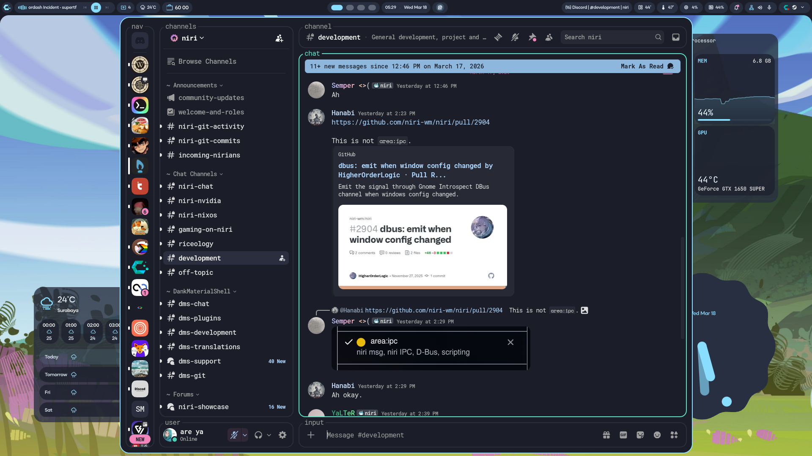
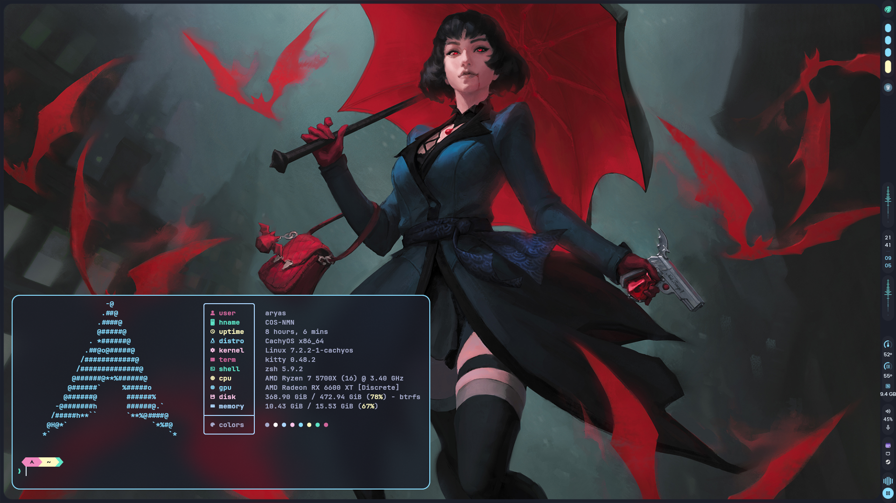
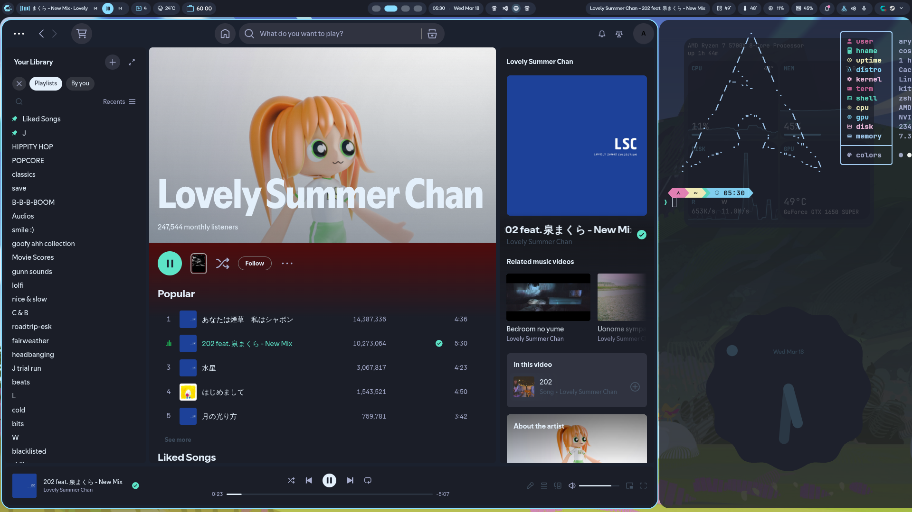
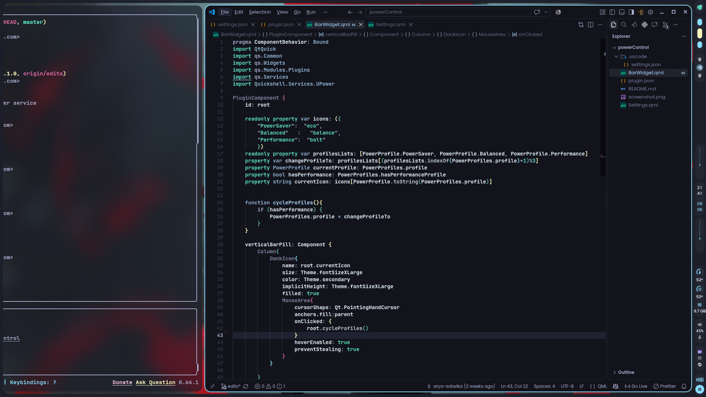
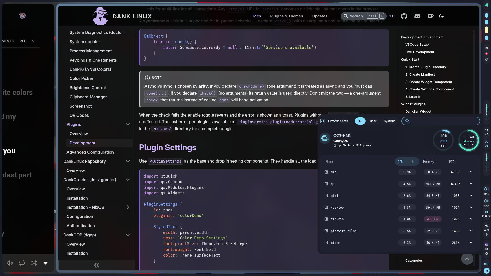
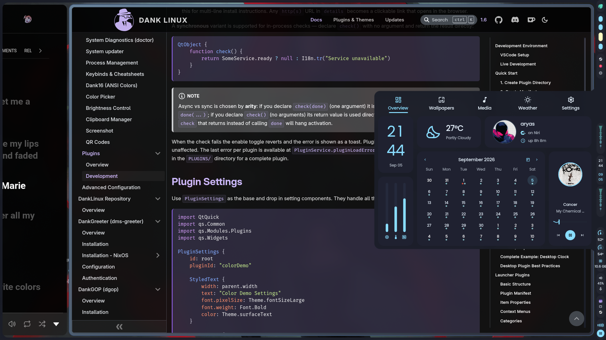
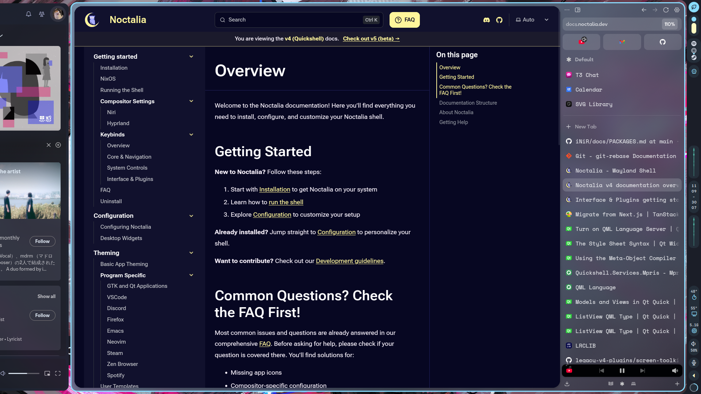
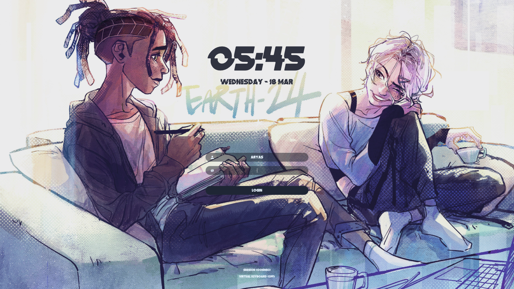
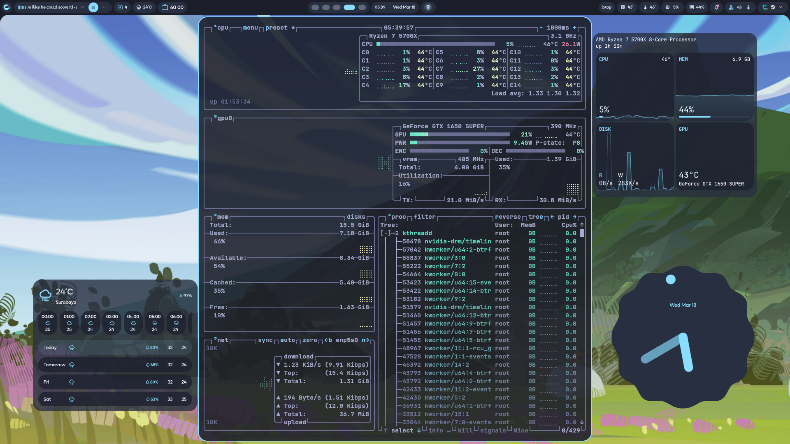

# My personal linux config
dotfiles for my [niri](https://github.com/niri-wm/niri) wm with [DankMaterialShell](https://danklinux.com/) "rice", mostly used to sync configs between my laptop and pc. global.kdl are configs that apply for both pc and laptop, config.kdl are system specific configs.
Rice / Theme is based off the [poimandres](https://github.com/drcmda/poimandres-theme) theme
## Wallpapers
all wallpapers in this repo are from artists on twitter, you can find their twitter by looking at the file name of the image, 
`by 'twitterHandle'.jpg`
## Stow
dotfiles are organized to work with GNU Stow, to apply configs run this command 
```bash
cd ~
stow vesktop #replace vesktop with name of app config that u want
```
## Other Repos used
- [omarchy pmndrs](https://github.com/leweyse/omarchy-pmndrs-theme/)
- [sddm astronaut theme](https://github.com/Keyitdev/sddm-astronaut-theme)

## Fonts used
- JetBrains Mono Nerd Font
- Okta Neue
- Distortion dos Analogue

### Screenshots
---









